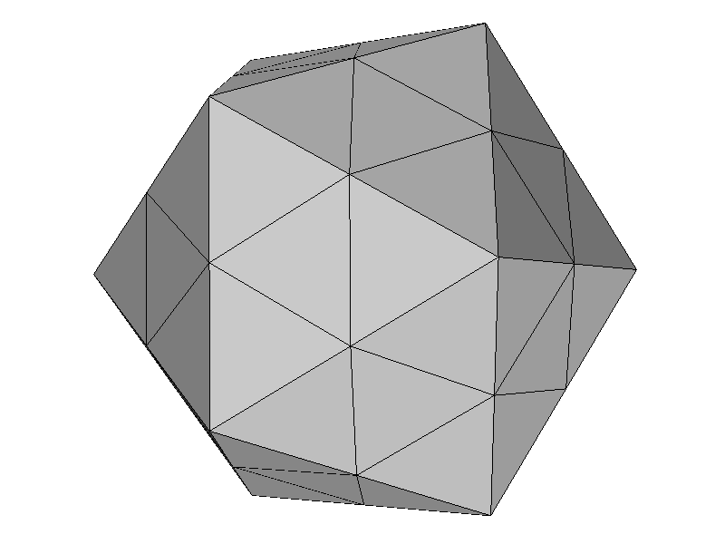

<h1>Tools for OFF files</h1>

<h2>Introduction</h2>

[OFF references](http://www.geomview.org/docs/html/OFF.html)

## Programs
* [off.volume](volume.awk) - compute volume of triangulated surface
* [off.area](area.awk) - compute area of triangulated surface
* [off.scale](scale.awk) - scale coordinates
* [off.refine](refine.awk) - refine triangulated surface

<h2>Install</h2>

<pre>
$ make
</pre>

<h2>Examples</h2>

<pre>
$ off.area test_data/icosa.off
3.8298165592841229e+01
$ off.volume test_data/icosa.off
2.0289205728439306e+01
$ off.scale 10 < test_data/icosa.off
*** output flushed ***
</pre>

<h2>Refine</h2>

